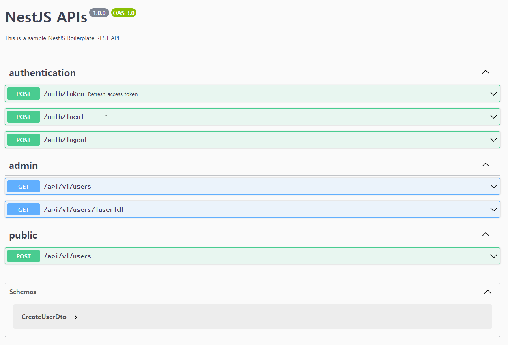

# NestJS Boilerplate

## Environment

- `Webstorm IDE`
- `Node v16.x`
- `NPM` for the package manager
- [Postman](https://www.postman.com/downloads/) for API endpoint testing and interaction
- `Postgres 15.3` with [Prisma](https://www.prisma.io/) library
- [Nestjs](https://github.com/nestjs/nest) for basic webserver
- `Docker` for the database and test env container (Install [Docker Desktop](https://www.docker.com/products/docker-desktop/) recommended)
- Default exposed ports below, You can change this by modifing `infra/docker-compose.yml` file

```
POSTGRES_DB: 5432
WEB_SERVER: 8080
```

## Before Start

### Step 1. Install [Docker Desktop](https://www.docker.com/products/docker-desktop/) for running Postgres

### Step 2. Set up infra

```bash
docker-compose -f infra/docker-compose.yml up -d
```

## Environment Injection

### Step 1. Setting domain for authentication

```bash
sudo vi /etc/hosts
# as-is : 127.0.0.1  localhost
# to-be
127.0.0.1  local.api.test.kr
```

### Step 2. Copy env.example to .env

- basic env values are already set up

```bash
cp .env.example .env
```

## How to use

### Step 1. Install dependencies

```bash
npm install
```

### Step 2. Set up Prisma

```bash
npm run local:db:push
npm run local:db:generate-client
npm run local:db:seed
```

### Step 3. Start server

```bash
npm run start:dev
```

## [Swagger api](http://localhost:8080/api#/)


